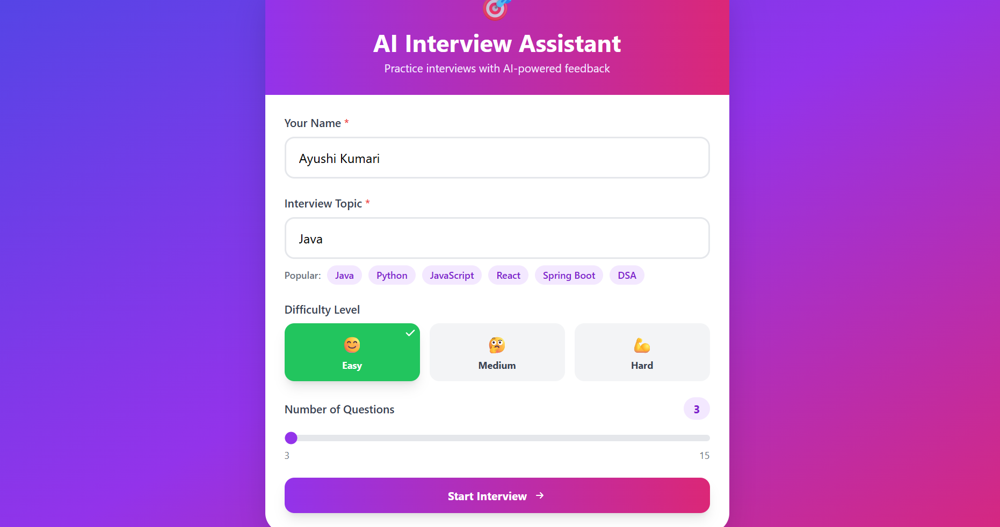
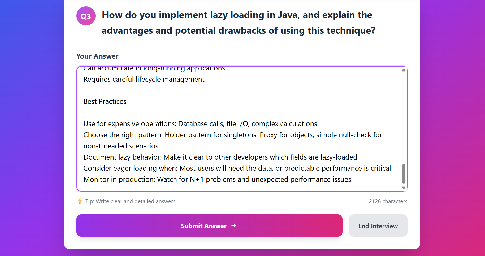
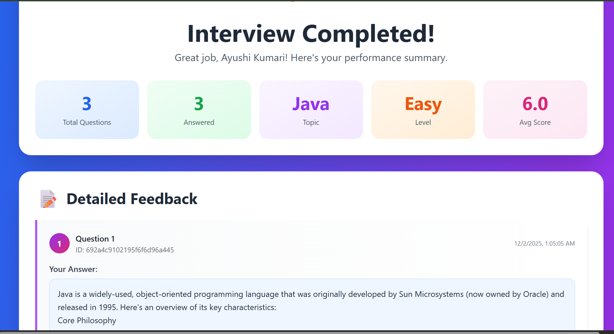

# 🎯 AI Interview Assistant
An AI-powered platform to practice technical interviews with real-time feedback, scoring, and personalized insights.

Built using **React (Vite)**, **Spring Boot**, **MongoDB**, **Tailwind CSS**, and **Groq’s Llama Model**.

---

## 🚀 Features

### 🔹 1. AI-Generated Interview Questions
- Automatically generates questions based on
    - Topic (Java, Python, React, DSA, etc.)
    - Difficulty level (Easy / Medium / Hard)
    - Number of questions

### 🔹 2. Real-Time Answer Evaluation
- Users type their answers
- AI evaluates accuracy, clarity, correctness
- Gives score (0–10) + improvement suggestions

### 🔹 3. Dynamic Interview Flow
- Next/Previous question navigation
- Answer autosave

### 🔹 4. Performance Summary
- Total questions answered
- Average score
- Topic & level
- Detailed feedback per question

---

## 🖼️ Screenshots

### 🏠 Homepage

### 📋 Interview Page

### 🧾 Summary Page

> Add these images in a folder named **screenshots/** inside the project.

---

## 🏗️ Tech Stack

### **Frontend**
- React (Vite)
- Tailwind CSS
- Axios

### **Backend**
- Spring Boot
- Groq AI (Llama 3.1 models)
- MongoDB

---

